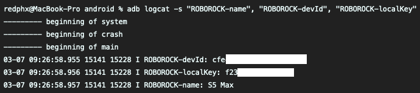

# Get Tuya token from Roborock app

These tokens are requried if you want to use Roborock vacuums on both Home Assistant and Roborock app.

## Android
1. Install any version of [modded Roborock app](android/) on your phone/Bluestacks/Genymotion... Remember to uninstall the old version first. This modded app will display tokens inside phone's Logcat.
2. You'll need `adb` tool. It's included in [Android SDK Platform Tools](https://developer.android.com/studio/releases/platform-tools).
3. [Enable USB Debugging](https://developer.android.com/studio/command-line/adb#Enabling).
4. [Connect your device](https://developer.android.com/studio/command-line/adb#connect-to-a-device-over-wi-fi-android-11+) to your Windows/Mac/Linux using ADB.
5. Run this command on your Windows/Mac/Linux to view Logcat: `adb logcat -s "ROBOROCK-name", "ROBOROCK-devId", "ROBOROCK-localKey"` (don't close it)
6. Open modded Roborock app and log in.
7. Your tokens will be displayed on your Windows/Mac/Linux.

## iOS
I used [Charles Proxy](https://www.charlesproxy.com/) to sniff packets on my iPad. It's rather complicated so I won't recommend doing this method unless you know what to do.
